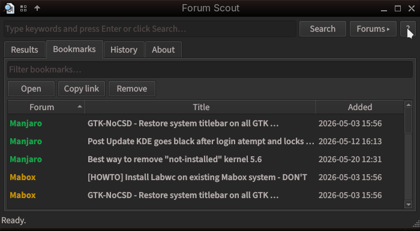
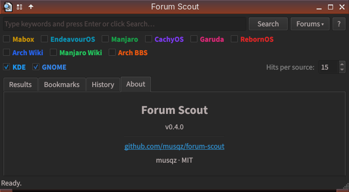

# Forum Scout

A lightweight PyQt6 desktop app that searches multiple Arch-based Linux forums at once. Built for KDE and Qt-based desktops.






---

## Features

- **Multi-source search** — query Discourse forums, Arch Wiki and Arch BBS in one go
- **Sortable results** — click any column header to sort by forum, title or date
- **Multi-select** — select multiple results to open all at once, or add/remove bookmarks in one action; right-click for context menu
- **Bookmarks** — save topics, open or copy links, filter and sort · results marked ★ when already bookmarked · add/remove directly from the results list · multi-select delete with `Del` · undo last delete with `Ctrl+Z`
- **Search history** — re-run any previous search with one click
- **Forums toggle** — hide the forum selector with the **Forums ▾** button to free up space for results
- **Dropdown suggestions** — live topic suggestions as you type (press Space)
- **Color-coded forums** — consistent colors across Results and Bookmarks tabs
- **Hover tooltip** — full URL shown in the status bar on mouse-over
- **Keyboard shortcuts** — `Ctrl+L` focus search · `F6` jump to results · `Enter` open row · `Ctrl+Enter` open all selected · `Ctrl+B` toggle bookmark · `Ctrl+F` toggle forums bar · `Escape` clear · `F5` re-run · `Del` delete bookmark(s) · `Ctrl+Z` undo · `?` show all shortcuts
- **Persistent settings** — window size, hits per source, active forums and forums bar state saved on exit
- **Custom forums** — add, remove or reorder forums via `forums.conf`; supports Discourse, MediaWiki and DuckDuckGo site-search types
- **Shared config with GTK version** — bookmarks, history, settings and forums are fully compatible; switching between the GTK and Qt versions loses nothing
- **Multilingual** — 18 languages auto-detected from `$LANG`: Arabic, Chinese, Danish, Dutch, English, Farsi, French, German, Greek, Hebrew, Japanese, Polish, Portuguese, Romanian, Russian, Spanish, Turkish, Ukrainian

---

## Sources

| Forum | Type | API |
|---|---|---|
| Mabox | Discourse | Discourse JSON |
| EndeavourOS | Discourse | Discourse JSON |
| Manjaro | Discourse | Discourse JSON |
| CachyOS | Discourse | Discourse JSON |
| Garuda | Discourse | Discourse JSON |
| RebornOS | Discourse | Discourse JSON |
| Arch Wiki | Wiki | MediaWiki JSON |
| Manjaro Wiki | Wiki | MediaWiki JSON |
| CachyOS Wiki | Wiki | DuckDuckGo site-search |
| Arch BBS | BBS | DuckDuckGo site-search *(off by default)* |
| KDE | DE | Discourse JSON |
| GNOME | DE | Discourse JSON |

---

## Install for Arch

repo:

- Mabox
- Manjaro
- AUR

```bash
yay -S forum-scout-qt
pacman -S forum-scout-qt
```

> Installs as `forum-scout` and conflicts with the GTK version — only one can be active at a time, but all your data carries over when switching.

---

## Custom Forums

All forums are defined in `forums.conf`, installed by the package to `/usr/share/forum-scout/forums.conf`.

To add, remove or reorder forums, copy it to your config directory and edit it:

```bash
cp /usr/share/forum-scout/forums.conf ~/.config/forum-scout/forums.conf
```

Each line is a JSON object:

```
{"name": "NixOS", "type": "discourse", "url": "https://discourse.nixos.org", "color": "#5277c3", "on": true, "group": "distro"}
```

| Field | Required | Description |
|-------|----------|-------------|
| `name` | yes | display name |
| `type` | yes | `discourse` · `mediawiki` · `ddg` |
| `url` | yes | base URL |
| `color` | yes | hex color for the checkbox label |
| `on` | no | `true`/`false` — default checkbox state (default: `true`) |
| `group` | no | `distro` · `wiki` · `de` — row in the forums bar (default: `distro`) |

- Lines starting with `#` are comments
- `~/.config/forum-scout/forums.conf` takes priority over the system file
- The file is shared with the GTK version — configure once, works in both

---

## Running on GTK / Openbox desktops

Forum Scout Qt is built for KDE and Qt-based desktops. On GTK-based desktops (XFCE, GNOME, Openbox, Mabox) Qt6 may fail to launch due to a missing XDG portal daemon. Fix it by forcing the X11 platform:

```bash
QT_QPA_PLATFORM=xcb forum-scout
```

To make it permanent, add this to your `~/.profile` or `~/.bash_profile`:

```bash
export QT_QPA_PLATFORM=xcb
```

---

## GTK version

Looking for the GTK3 version? → [github.com/musqz/forum-scout](https://github.com/musqz/forum-scout)

---

## Disclaimer

Parts of this tool were built with AI assistance (Claude Sonnet by Anthropic). All code has been reviewed and tested by me.
